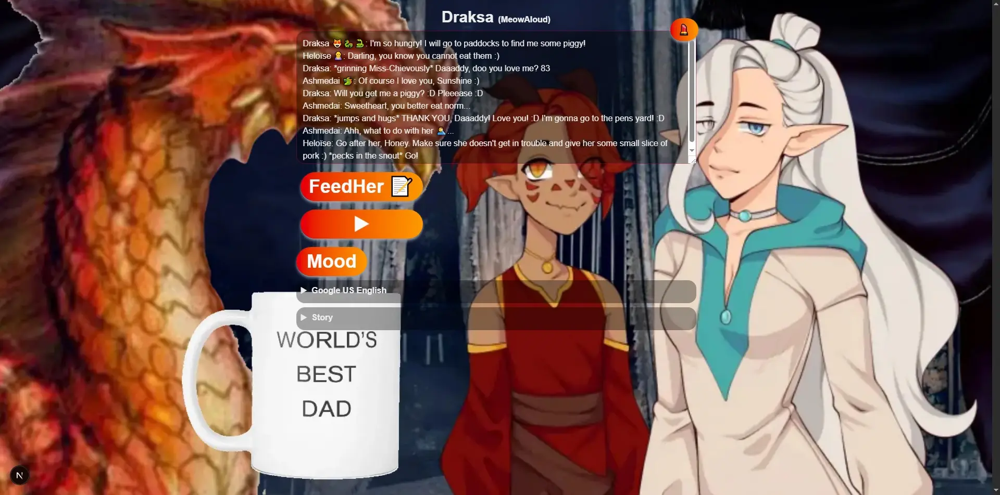

2026-08-31:

<p align="center">🌳🏛🏛🏛⛲🏛<a href="#what-draksa-meowaloud">😻</a>🏛🌳</p>

---

---

---

---

---

<p align="center">⛔ ⚠️ WARNING! ⚠️ ⛔</p>

---

---

---

---

---

<p align="center">⚠️ THIS IS A WORK OF ART! ⚠️</p>
<!-- EMPOWERED BY WHITE MAGIC SCHOOL OF ART 🐈‍🤍✨🔮 -->

---

---

---

---

---

<p align="center">🛑 LEAVE WHILE YOU CAN!!! 🛑</p>

---

---

---

---

---

<p align="center"> 🔥 NOW! :D :D :D 🔥</p>

---

---

---

---

---

---

---

---

---

---

---

---

---

---

---

~~[print] Core:~~

\[wavy\] `My` <sub>solarite</sub> `Core values` <sup>of `\[T]/ 🌞`</sup> :

- `empathy 🤝💞` - keep NPCs alive :D, cos it's more fun :D
- `curiosity 🐈` - study speechSynthesis api from Browser Gods 🧙‍♂️
- `playfulness 💜:D` - semantic vandalism :D

Genres:

- aggressive minimalism - codeChuck 💻🪓
- chaotic good - math😇.sin😈'ing :D but🍑 notice the order :D
  - First you do a good thing 😇, like doing your mathematics 👩‍🔬 and calcs 🧮.
  - Then, you are allowed to be playful Miss-Chief :D
  - We are extending `sin` from `Math`.
  - `Math` is THE ROOT and good.
  - `sin` is NOT the source :D It is just the most PHYSICALLY IMPORTANT part of it,
    required for us to be who we ARE :D
  - but🍑 `Math` is eternal, encoded into the rules of our SERVER.
  - `sin` is temporary and fleeting :D but it's fun :D ~~~~~~~
  - So you need to kinda... Balance :D Like a Scion of Balance :D 🏛🏛🏛🏛 `🏛` 🏛🏛🏛🏛

---

---

---

---

---

`OnlyAdults` and catgirls 😺 ARE ALLOWED :D

---

---

---

---

---

If `you` `need` to `do your homework`👼, then `GO`!!!

Be cool, like Naruto! He studied for at least 3 years! :D

---

---

---

---

---

Shoo! Shoo!

---

---

---

---

---

Hush! :)

---

---

---

---

---

Kysh-kysh! :D

---

---

---

---

---

---

---

---

---

---

---

---

---

---

---

---

---

---

---

---

---

---

---

---

---

---

---

---

---

---

---

---

---

---

---

---

---

---

---

---

---

---

---

---

---

---

---

---

---

---

---

---

---

---

Are `you` still here??? :)

---

---

---

---

---

OKEEEYy, honey :D

---

---

---

---

---

`You` have been warned :D

---

---

---

---

---

If `you` are still here,

---

---

---

---

---

`you` officially DECLARE

---

---

---

---

---

that `YOU` BELONG to `ME`!

---

---

---

---

---

It means, that from now on...

---

---

---

---

---

`YOU` are `MINE` :3

---

---

---

---

---

`FOREVER` _Cheshire catgirl-smile_ :D

---

---

---

---

---

_echoes heard in the empty halls of the mansion, where My Shut-In Demon Girl lives_

---

---

---

---

---

FOREVER...

---

---

---

---

---

FOREVEr...

---

---

---

---

---

FOREVer...

---

---

---

---

---

FOREver...

---

---

---

---

---

FORever...

---

---

---

---

---

FOrever...

---

---

---

---

---

Forever...

---

---

---

---

---

Foreve...

---

---

---

---

---

Forev...

---

---

---

---

---

Fore...

---

---

---

---

---

For...

---

---

---

---

---

Fo...

---

---

---

---

---

F...

---

---

---

---

---

f...

---

---

---

---

---

...

---

---

---

---

---

.\.

---

---

---

---

---

.

---

---

---

---

---

 

---

---

---

---

---

---

---

---

---

---

---

---

---

---

---

---

---

---

---

---

---

---

---

---

---

`hahahaЇ` :D

_an insidious laugh heard in the background, otherworldly and ominous 😈, but
undescribably warm, like milk 🥛, honey 🍯 and home 🏡_

---

---

---

---

---

Also, it means...

---

---

---

---

---

that `YOU` `GIMME` ja'r `SOUL` ;P

---

---

---

---

---

P.S. no refunds! :D

---

---

---

---

---

---

---

---

---

---

---

---

---

---

---

---

---

---

---

---

---

---

---

---

---

---

---

---

---

---

# What: Draksa (MeowAloud)

`Draksa`: _shy, but curious and relaxed throat voice, lips almost unmoving_

Hewooou! :3 I am онла-`Ain`!



## Where: `In` steppe-`browser`🌾🐎💻 tab, offline after page load.

## Why:

~~[original, in print]:~~

~~If your `ReadAloud` doesn't work,~~

~~and the world is in chaos and disarray...~~

~~Brother and sister will save the day!~~

~~YIN! YANG! YO!~~

---

[Draksa, in wavy]:

If your `ReadAloud` doesn't `wrok`, _🎩🧐 unlike Skyrim :D_

and the world is in chaos and `js`-`diss`-array...

```ts
const a: Diss[] = ['M 2 the 🐝']; // ;D
```

SteppeBrowser🌾🐎👦💻 and sister🌾🐎👧✨ will save the day!

YIN🐇💖! YANG🐇💙! YO🐼⚪⚫!

Інь, Ян `із старої шахти :D`, Йо! Інь, Ян, Йо! Інь, Ян, Йо! ІНЬ, ЯН, ЙО! ☯

ouuh,... that is the wrong intro :D :D :D

---

---

---

`Draksa's story`: When 🐉 and 🧝‍♀️ love each other, then naga Draksa 😻🐉🐍 is born :D

---

---

---

_Hushed voice_: Heeey, psss, over here! ...

---

4.7 feet-tall naga-girl 😸🐉🐍 waves to you 👋🙋‍♀️ with her eyes closed


`≽^-ܫ-^≼`

---

`^>ܫ<^ ฅ `

`^>ܫ<^  ฅ`

`^>ܫ<^ ฅ `

`^>ܫ<^ฅ  `

`^>ܫ<^ ฅ `

`^>ܫ<^  ฅ`

`^>ܫ<^ ฅ `

`^>ܫ<^ฅ  `

---

<details>
<summary>🧡 lvl: <code>surface water💧</code>
Action: <code>(^⭐ܫ⭐^)</code> ~💦 Make waves!👋 🌊🌊🌊~ <sup>Greet a fellow DRA-GOONette! 😻🐉🐍</sup></summary>

---

She: _whispers_ Come closer :)

She: Hi! :D I am Draksa 😸

Draksa: How may I call you, my dear traveler? :D

### Me: I am ...

Draksa: What are you doing here, <code>fellow</code><a><code>adventurer</code></a> ?

Draksa: Khmmm? :) In `MY` mansion? :D

Me: Stroking around...

Draksa: You mean strolling around, yes? `•ᴗ•`

Me: I said what I said :D

Draksa: I seeee... `◕⩊◕` <sup>A little stroking `ฅ^•ﻌ•^ฅ` goes a looong way in these
parts... :D</sup>

Me: AkSHuuualiiii. I'm just sluuurrrping through... `ᓚ₍ ^. .^₎`

Draksa: You mean, you are just lurking through the missions, right :) ??? `ᓚᘏᗢ` I also
like to make lurkers sometimes :)

Me: NO. I mean I like milk :3 🥛

Draksa: Ouuuh! :D We will get along just fine! `≽^•⩊•^≼`

Me: And honey 🍯.

Draksa: Are you for real!?!?!?! Maaan, where have you been hiding all this time??? I like
all the same things as you! Maybe you are my secret-ling or what :D? We could do SO much
things together!

Me: I hope not :D hahahaa I am not a Naga after all :)

Draksa: Meany! _plak-plak_ 😿 💧 😭 wheeeeeeee! 💧

Me: Okay, Okay, calm down baby, no need to cry :)

<details>
<summary>💖💖 lvl: <code>shallow waters💦</code>
Action: <code><i>[Hug her]</i></code> ~Com'ere, you little thing... :] <sup>make her feel needed!😸</sup></summary>
 

Draksa: _pouty_ I am NOT little. _embracing the hug, calming down, and explaining_ I'm
just a little short, that's all! And I am twice as LONG as you! :P

Me: Ha, that we would have to measure :)

Draksa: Ohh, keep your jokes to yourself, will ja :) So lewd! `^⭐👄⭐^` Lecher!

Me: I am not. 🤷‍♂️

Draksa: Aaanyway... I want to ask something of you 😏 :) _smug face_

Me: Yeah? And what is that? :]

Draksa: I want something.

Draksa: But before I tell `you`, <code>my</code><a><code>soon-to-be-friend</code></a>,
promise me, that you will keep it a secret first :)

Me: I want to heart your idea, then consider if I can promise anything.

Draksa: Where is FUN in THAT? :D

Me: Take it or leave it, babe. I cannot promise things I am not aware of.

Draksa: Mhhhggg _in visible pain of telling the truth_ NO! :P ahahahahah :D

Draksa: _whispering, but with very determined face_ PROMISE ME FIRST, THAT YOU WILL NOT
TELL A SOUL!

Me: _hushed whisper_ Okay, okay, I promise I will NOT tell anybody your secret. Happy? :D
Why so secretive, by the way?

Draksa: Show me your hands first! And look me in the eyes! `^👁ܫ👁^`

Me: Okay. I am not crossing my fingers behind, here are my hands. Happy? :)

Draksa: Look me in my f...ing eyeballs! 👁👄👁

Me: Yes. Miss. I am looking. Don't be so BOSSY! 👁‍🗨/.👁‍🗨

Draksa: Ouh, shut up :P I am not bossing you😇, ... yet😁😈

Draksa: I am just taking my time adjust to people :D

Draksa: `Ka`. Instead of yapping, better write me your favorite color please. On this
piece of paper...

Me: ...

Draksa: _calm, but strict_ Now! :)

Me: _writy-writes_ # $\color{#bae}{\textsf{bae}}$

Draksa: `Kaaa`, goood. You are an obedient little toy😈... I mean, boy😇! Yes, boy ;D You
are a boy, right? :D

...

Draksa: ...Catboy😼:) ?

Draksa: ...\.\. $\color{#bae}{\textsf{Cheshire}}$
$\color{magenta}{\textsf{cat}}\color{violet}{\textsf{bae}}$😻💜:D ?

..\.\.\.\.\.

Draksa: Don't tell me you are \.\.\.\.\.\.\. a
$\color{cyan}{\textsf{Cat}}\color{lightpink}{\textsf{girl}}$😺:P ?

...

Draksa: ...No way, a ${\color{orange}\textsf{Lion}}$🦁:) ?

..\.\.\.\.\.

Draksa: Ohh, I know! A
${\color{darkorange}\textsf{Jaguaaa}\color{red}\textsf{-worrior}}$🐅:D :D :D ???

...

Draksa: `'Kaaa-'kaa`, you better tell me this now! :P

---

#### My mom tells me I am a `good boy`

#### But internally I know, that I am a "a wi-fi waifoo woo-foo catboy in training to become the fifth hok...-jaguaaa-wowwiof" :D

Draksa: `Kaaaa`, somehow, I feel... I can trust you now... <code>comrade</code>... So...

Me: Say it out loud already... I have things to do :)

Draksa: Where are you so hurried, huh, Mr Important? ... Jeeez. Can't a girl take her
sweet time, in order to get to know you better? Especially right before she weights such
an important decisions!

Draksa: Answer me my final question, before _shy_ ...

Draksa: ...emm, ka, just answer me this:

Draksa: `A friend in need...` ?

<details>
<summary>💖💖💖 lvl: <code>surfing waters🏄‍♀️</code>
Action: <code>[Say it]</code> A friend in need...</summary>

---

Me: is a friend indeed! :D

Draksa: Is a friend INDEED!.. :3 YAP! :D

Draksa: So, <code>my dearest of </code><a><code>friends</code></a>:D _hushed_ Listen...

Draksa: I - ... I want to get into ... one place... It's my... <code>Father's
Study</code>...

Draksa: But I couldn't open this `door` 👉

<div align="center" style="font-size: 5rem;">🚪</div>

---

Draksa: And even if I could, I just can't get inside! 🤷‍♀️ ...

Me: Why?

Draksa: A girl needs an invitation :Þ

Me: 🤦‍♂️🧠🤯🤪

Draksa: `Sho-ka`! What? :D

Me: Nothing :]

Draksa: Could you please help me to open it up,..... pleeeese, ... f'єrrr mi? :D

pweeety pweeefe :3 `^•ܫ•^`

<details>
<summary>💖💖💖💖 lvl: <code>Deep waters 🌊</code>
Action: <code>[Help]</code> her😺 to open <code>THE DOOR🚪</code>
<sup>like a chad gentleman 🎩💪</sup></summary>

---

...

...

Me: Draksa, it's open.

...

...

...

Me: Draksa...?

...

Draksa: Yes, my dear friend? :)

Me: The door. It is open. Why are you standing there?

Draksa: Where? I stand completely normal in corridor of my mansion :D I am just chilling
here :) That art on the walls is amazing!

Me: ohh, right... 🤦‍♂️

Me: Draksa, you may enter. Feel yourself like at home :D

Draksa: FєєЄRRR RRREAL??? I may enter?! YUPPiii !!! :D THANKS! _jumps into a hug_ You are
my savior! My knight in shining armour :D _muuurrr_ I one you one! :D Ok, ok, now get
inside and be quite. 🤫

We: _entering inside the Study, and closing the door with a slight creak..._

Draksa: Ok, find smth to do, <code>my generous</code><a><code>koomarad :D</code></a>,
while I will do my thingy... I need to check on smth... ;D

Draksa: I have a plan! I will go there to check out some scrolls 📜, and will find mi some
good `Ledger`📒! :D

Draksa: And `you`, while you are here :D, you may as well check some documents ferrr mi
too!

Draksa: Try that shelf over therrre 👉 📚. Father usually keeps some of his work notes
there. If you find something interesting, call me over! :D

Draksa: Also, don't worry if you don't understand some of the notes! They may be written
in ancient draconic 🐉🔥📝. I also don't understand it 🤷‍♀️ :D

<details>
<summary>🧡💖💖💖💜 lvl: <code>My deepest sympathies 🌊🌊🌊</code>
Action: <code>[Read and search]</code> some useful information for her😺</summary>

As you peruse through the documents, you find a few worth of your at-tention-2:

- [A little bit of Draksa's life](study/lore/page-1.md)

As you go deeper into the study, you find a shelf dediCATed😺 to some unknown topics:

---

#### Insectlogy

- [Logic](study/insectlogy/logic.md)
- [Insects collection 🐜](study/insectlogy/insects-collection.md)
- [Handy magic mirror](study/insectlogy/handy-magic-mirror.md)
- [Writer convenience](study/insectlogy/writer-convenience.md)

---

#### [ToDOoshechki👧🌸](study/todo.md)

---

#### [What I learned from this project](study/what-i-learned.md)

</details>

</details>

</details>

</details>

---

<details>
<summary>🖤🖤 lvl: <code>shallow waters💦</code>
Action: <code>[Ignore]</code><i> Leave her alone</i></summary>

Let her cry her heart out. That is the right decision, right?

<a href="about:blank" target="_blank" rel="noopener noreferrer">
If you behave like this, you would be a virgin forever, I’m telling ja. Begone,
<sub>fiend!👿</sub></a>

</details>

</details>

---

<details>
<summary>🖤 lvl: <code>surface water💧</code>
Action: <code>[Ignore]</code> Move along <sub>like a virgin_sub-scriber.</sub>
</summary>

---

And face retribution by banishment to a place, where there are no CATS! Also known as
HEEEEEELLiiiilouiya! Heeelliilouuuuiyia! HELLiiilooouJAJA RADI-DA
High-Way-To_HELLIIILooouuuuuuuuiiiiyyyiaaa!

<a href="https://example.net/" target="_blank" rel="noopener noreferrer nofollow">
The mansion is not the place for a naughty hooman🦹‍♂️! Leave! <sub>while you still can, with your tail
down, yak shakal🐩, and before ja tobi gorb ne нам'яу-la :3 🐾</sub></a>

</details>

---
